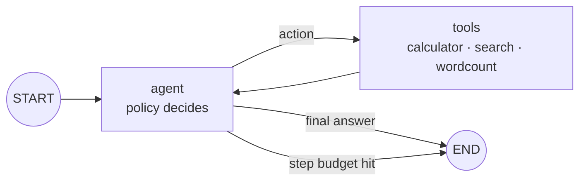

# agent-graph

[](https://github.com/egnaro9/agent-graph/actions/workflows/ci.yml)
[](https://www.python.org/)
[](https://langchain-ai.github.io/langgraph/)
[](LICENSE)

**A LangGraph ReAct agent with deterministic, safety-guarded tools — a multi-step tool-using agent you can actually unit-test.**

Agents are hard to test because the model is nondeterministic. This repo separates the two concerns: the **graph** (the orchestration — nodes, conditional edges, state, the tool loop, the step-budget guard) is real LangGraph and fully deterministic; the **policy** (the "which tool next" brain) is a swappable interface. A rule-based `MockPolicy` makes the whole agent reproducible and CI-testable with no API key; an `LLMPolicy` drops a real function-calling model into the exact same graph.

```
START ─► agent ──(tool call)──► tools ──► agent ──(final answer │ step-guard)──► END
```

- **Real LangGraph.** `StateGraph` with append-only `steps`/`observations` reducers, a conditional `agent → tools → agent` loop, and a compiled app you `invoke`.
- **Multi-step tool use.** *"What is 15% of 240 and who wrote Hamlet?"* → the agent calls `calculator`, then `search`, then composes the answer — and the full trace is returned.
- **Guardrails that matter.** A **safe calculator** (AST allow-list, so `__import__('os')` is rejected, not executed) and a **max-step budget** so a mis-behaving policy can never loop forever. Both are unit-tested.
- **Deterministic & offline.** **17 tests, green CI, no secrets.**

---

## How it works



Each turn appends to a trace, so you can see exactly what the agent did:

```bash
pip install -e ".[dev]"
python -m agentgraph.cli run "What is 15% of 240 and who wrote Hamlet?"
```
```
Q: What is 15% of 240 and who wrote Hamlet?
  → call calculator('15/100*240')  [compute 15% of 240]
    = 36
  → call search('What is 15% of 240 and who wrote Hamlet?')  [look up 'hamlet']
    = Hamlet was written by William Shakespeare.
A: 36 Hamlet was written by William Shakespeare.
```

`run()` returns the final state — `answer`, the full `steps` trace, and every tool `observation` — so it's easy to assert on in a test:

```python
from agentgraph import run
state = run("What is 12 * 8?")
assert "96" in state["answer"]
assert [s for s in state["steps"] if s["type"] == "action"][0]["tool"] == "calculator"
```

## The two guardrails, tested

**Safe calculator** — the tool never runs arbitrary code:
```python
from agentgraph import calculator, ToolError
calculator("2 + 3 * 4")          # "14"
calculator("__import__('os')")    # raises ToolError — names/calls are not allowed
```
It walks a parsed `ast` and permits only arithmetic nodes ([`tools.py`](agentgraph/tools.py)).

**Step budget** — a policy that never finishes still terminates:
```python
build_graph(policy=AlwaysActsPolicy(), max_steps=3)   # the agent node forces a finish at the budget
```
See [`test_graph.py::test_max_steps_guard_prevents_infinite_loop`](tests/test_graph.py).

## Swapping in a real model

The graph doesn't change — only the policy does:
```python
from agentgraph.graph import build_graph
from agentgraph.policy import LLMPolicy      # needs: pip install -e ".[openai]" + OPENAI_API_KEY

app = build_graph(policy=LLMPolicy(model="gpt-4o-mini"))
app.invoke({"query": "...", "steps": [], "observations": [], "step_count": 0, "max_steps": 6})
```
`LLMPolicy` uses OpenAI function-calling to pick tools; `MockPolicy` uses deterministic rules. Same `decide()` / `compose()` interface, same loop, same guardrails.

## Layout

```
agentgraph/
  graph.py    build_graph() -> compiled LangGraph; run(query) -> final state
  state.py    AgentState (TypedDict) with append-only trace reducers
  policy.py   MockPolicy (deterministic) · LLMPolicy (optional, function-calling)
  tools.py    calculator (safe AST eval) · search (KB) · wordcount · run_tool
  cli.py      `run "<query>"` · `demo`
tests/        17 tests — tools, safety, multi-step traces, the step-budget guard
```

## Design notes

- **Why split graph from policy?** So the deterministic part (orchestration, guardrails, tracing) is testable without a model, and the model is a drop-in. This is the pattern that makes agent code maintainable: the risky, nondeterministic piece is isolated behind one interface.
- **Why a rule-based mock instead of a stub?** The mock actually *plans* (parses the query into an ordered tool sequence), so it exercises the real multi-step loop — not just a single hop.

## Run it in Docker

```bash
docker build -t agent-graph . && docker run --rm agent-graph   # runs the demo
```

---

Built by [Erik Hill](https://egnaro9.github.io) · MIT licensed.
